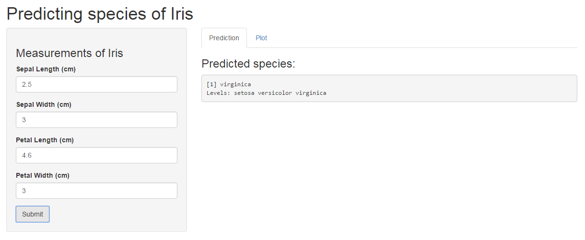

Predicting Iris species Application
========================================================
author: Sum Nga Lai
date: 12 Jan 2016

Application Url: https://nlsum.shinyapps.io/iris/

github Url for application: https://github.com/nlsum1/DevelopingDataProducts/tree/master/iris

github Url for presentation: https://github.com/nlsum1/DevelopingDataProducts/tree/master/doc

Function 1:  Predict
========================================================
The application is mainly used to predict the Iris species, based on the following input entered by user: Sepal length, Sepal width, Petal length and petal width

The prediction model being used by this application, is built and trained by the package "RandomForest": 


```r
model <- train(Species~., data=iris, method="rf")
```

The data being used: 
https://dataminingproject.googlecode.com/svn/DataMiningApp/datasets/Iris/iris.csv


Function 2: Plot
========================================================
This application also allows user to plot and observe a scatter plot using Iris data, by selecting X and Y axis variable of the Iris table.


Some data in Iris dataset:


```
  Sepal.Length Sepal.Width Petal.Length Petal.Width Species
1          5.1         3.5          1.4         0.2  setosa
2          4.9         3.0          1.4         0.2  setosa
3          4.7         3.2          1.3         0.2  setosa
4          4.6         3.1          1.5         0.2  setosa
```


Example 1: Predicting Iris Species
========================================================
The following screenshot shows the result displayed in the first panel:



Example 2: Plotting scatter plot of Iris data
========================================================

The following screenshot shows the scatter plot displayed in the second panel:


